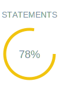

<br />
<div align="center">
  

  <h1 align="center">js-coverage-badges</h1>

  <p align="center">
    This library implements badges for JavaScript test coverage. It supports tests using either Mocha or Jest implementations.    
  </p>
</div>


<!-- CONFIG -->
## Get Started

### Requirements 

Configure Jest or Mock.

#### Mocha Configuration

Using:
```
"nyc": "^15.1.0",
```

Add the following to your `package.json`:
```
"nyc": {
    "extension": [
      ".js"
    ],
    "reporter": [
      "json-summary",
      "lcov",
      "text"
    ],
    "include": [
      "src"
    ],
    "exclude": "**/*.mock.js"
  }
```

Run:
```
nyc report --reporter=lcov --reporter=text --reporter=json-summary
```

It is necessary to have the `.nyc_output` folder.

#### Jest Configuration

Run:
```
jest --coverage --coverageReporters="json-summary"
```

It is necessary that the coverage folder exists.

<!-- USAGE -->
## Usage

1. Install the library:
```
npm install 
```

2. Run the command:
```
npx js-coverage-badges {badges_output}
```

**Example:**
```
npx js-coverage-badges badges_output
```

This command will create a folder:

```
└── badges_output
     ├── branches.svg
     ├── functions.svg
     ├── lines.svg
     └── statements.svg
```

Add the following to your `README.md`:

```
**Tests Coverage**

| Statements                  | Branches                | Functions                 | Lines             |
| --------------------------- | ----------------------- | ------------------------- | ----------------- |
|  |  |  |  |
```

That will displays something like:

**Tests Coverage**

***Badges***

| Statements                  | Branches                | Functions                 | Lines             |
| --------------------------- | ----------------------- | ------------------------- | ----------------- |
|  |  |  |  |

***Charts***
        


<!-- CONTRIBUTING -->
## Contributing

Contributions are what make the open source community such an amazing place to learn, inspire, and create. Any contributions you make are **greatly appreciated**.

If you have a suggestion that would make this better, please fork the repo and create a pull request. You can also simply open an issue with the tag "enhancement".
Don't forget to give the project a star! Thanks again!

1. Fork the Project
2. Create your Feature Branch (`git checkout -b feature/AmazingFeature`)
3. Commit your Changes (`git commit -m 'Add some Feature'`)
4. Push to the Branch (`git push origin feature/Feature`)
5. Open a Pull Request


<!-- LICENSE -->
## License

Distributed under the MIT License. See `LICENSE.md` for more information.

<!-- CONTACT -->
## Contact

Created by: [@marialuisacp](https://github.com/marialuisacp)  -  [contato@malu.dev](mail:contato@malu.dev)
